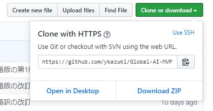
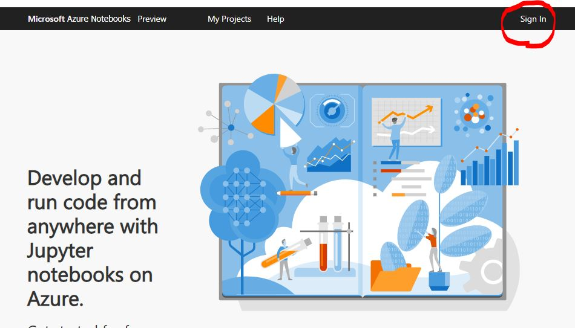
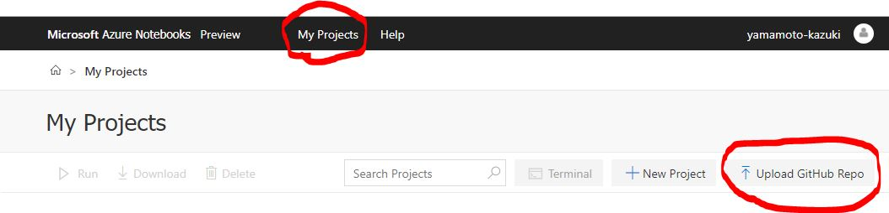
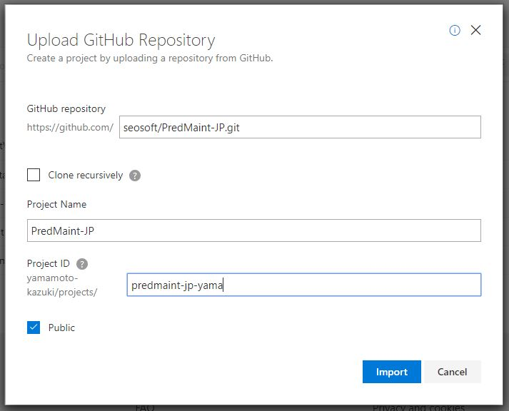

### <b>概要</b>
このプロジェクトは、Global AI Night（2019年4月2日）で使用される Automated ML ワークショップの手順とノートを含みます。
このワークショップは、次のステップに沿って進めます：
1. ワークショップを行うために Azure Notebooks プロジェクトをセットアップする
2. Automated ML のトレーニングのために Azure Machine Learning ワークスペースを構成します
3. Predictive maintenance NASA sample ノートブックを実行します。以下の手順を含みます :   

### <b>シナリオ</b>
このシナリオでは、エンジンが故障するまでのサイクル数、残存有効寿命を予測します。

### <b>手順</b>
1. [日本語版ワークショップの GitHub リポジトリ](https://github.com/seosoft/PredMaint-JP) にアクセスします。  
2. [Clone or download] で Clone 用の URL を取得します。（クリップボードにコピーします）  

3. [Azure Notebooks](https://notebooks.azure.com) に接続してサインインします。 
 
4. [My Project]をクリックし、[Upload GitHub Repo] をクリックします。

5. 手順3でコピーした GitHub の URL を [GitHub Repository] に貼り付けます。プロジェクト名とプロジェクトIDを入力します。クローン先のプロジェクトをパブリックにしたくない場合は、[public] チェックボックスをオフにします。

6. ノートブックファイル（Predictive maintenance NASA sample.ipynb）を開き、指示に従います。

### 英語版ワークショップの利用開始手順
1. [Azure Notebooks](https://notebooks.azure.com) に接続してサインインします。  
2. [Predictive maintenance NASA sample.ipynb](https://notebooks.azure.com/deepak-notebook/projects/predmaint/html/Predictive%20maintenance%20NASA%20sample.ipynb) にアクセスします。
3. [Clone] をクリックします。
4. プロジェクト名とプロジェクトIDを入力します。クローン先のプロジェクトをパブリックにしたくない場合は、[public] チェックボックスをオフにします。
5. ノートブックファイル（Predictive maintenance NASA sample.ipynb）を開き、指示に従います。

### <b>参考文献</b> 
* https://aka.ms/automatedmldocs 
* http://aka.ms/automatedmlsamples 
* http://aka.ms/automatedml